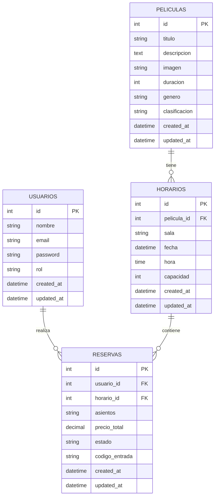

# Sistema de Gestión de Cine

## Índice
- [Introducción](#introducción)
- [Objetivos](#objetivos)
- [Requisitos](#requisitos)
- [Tecnologías](#tecnologías)
- [Modelos de Datos](#modelos-de-datos)
- [Funcionalidades](#funcionalidades)
- [Estructura](#estructura)
- [Ejemplos de Código](#ejemplos-de-código)
- [Seguridad](#seguridad)
- [Mejoras Futuras](#mejoras-futuras)
- [Instalación](#instalación)

## Introducción

Sistema de gestión de cine desarrollado con Laravel que permite a los usuarios reservar entradas de manera intuitiva y eficiente. El sistema incluye gestión de películas, horarios, reservas con selección visual de asientos y generación de códigos QR para las entradas.

### Justificación
- Modernización del proceso de reserva de entradas
- Mejora de la experiencia del usuario
- Optimización de la gestión de salas y horarios
- Reducción de tiempos de espera

## Objetivos

### Generales
1. Plataforma web intuitiva para reserva de entradas
2. Gestión eficiente de películas y horarios
3. Experiencia de usuario optimizada

### Específicos
1. Sistema de selección visual de asientos
2. Panel de administración para gestión de contenidos
3. Sistema de códigos QR para entradas
4. Gestión de usuarios y roles
5. Reservas en tiempo real

## Requisitos

### Funcionales
1. Gestión de usuarios:
   - Registro e inicio de sesión
   - Perfiles de usuario y administrador
   - Gestión de reservas personales

2. Gestión de películas:
   - CRUD completo
   - Gestión de imágenes
   - Categorización por géneros

3. Gestión de horarios:
   - Programación de sesiones
   - Asignación de salas
   - Control de disponibilidad

4. Sistema de reservas:
   - Selección visual de asientos
   - Generación de códigos QR
   - Validación en tiempo real

### No Funcionales
1. Rendimiento:
   - Tiempo de carga < 3 segundos
   - Soporte para múltiples reservas simultáneas

2. Seguridad:
   - Autenticación segura
   - Protección XSS y CSRF
   - Cifrado de contraseñas mediante bcrypt
   - Protección de rutas sensibles mediante middleware
   - Encriptación de datos sensibles

3. Usabilidad:
   - Diseño responsive
   - Interfaz intuitiva
   - Accesibilidad web

## Tecnologías

### Backend
- Laravel 12.0
- PHP 8.2
- MySQL

### Frontend
- Blade Templates
- Bootstrap
- JavaScript
- CSS3

### Librerías
- SimpleSoftwareIO/QrCode
- Laravel UI
- Font Awesome

## Modelos de Datos

### Diagrama Entidad-Relación (ERD)



### Relaciones
- Un Usuario puede tener múltiples Reservas
- Una Película puede tener múltiples Horarios
- Un Horario puede tener múltiples Reservas
- Cada Reserva pertenece a un Usuario y un Horario específico

## Ejemplos de Código

### 1. Selección Visual de Asientos

```javascript
document.addEventListener('DOMContentLoaded', function() {
    const asientos = document.querySelectorAll('.seat-checkbox');
    const selectedSeatsElement = document.getElementById('selected-seats');
    const totalPriceElement = document.getElementById('total-price');
    const PRECIO_POR_ASIENTO = 8;

    function formatearPrecio(precio) {
        return precio.toLocaleString('es-ES', {
            minimumFractionDigits: 2,
            maximumFractionDigits: 2
        }) + ' €';
    }

    function actualizarResumen() {
        const asientosSeleccionados = Array.from(asientos)
            .filter(asiento => asiento.checked)
            .map(asiento => asiento.value);
        
        selectedSeatsElement.textContent = asientosSeleccionados.length > 0 
            ? asientosSeleccionados.join(', ') 
            : '-';
        
        const total = asientosSeleccionados.length * PRECIO_POR_ASIENTO;
        totalPriceElement.textContent = formatearPrecio(total);
    }

    asientos.forEach(asiento => {
        asiento.addEventListener('change', actualizarResumen);
    });
});
```

### 2. Generación de Códigos QR

Implementación del controlador para generar códigos QR de las entradas:

```php
public function mostrarQR($id)
{
    $reserva = Reserva::with('horario.pelicula')->findOrFail($id);
    
    if ($reserva->user_id !== auth()->id()) {
        abort(403, 'No tienes permiso para ver este QR');
    }

    $datosQR = [
        'codigo' => $reserva->codigo_entrada,
        'pelicula' => $reserva->horario->pelicula->titulo,
        'sala' => $reserva->horario->sala,
        'asientos' => $reserva->asientos,
        'hora' => $reserva->horario->hora,
        'fecha' => $reserva->horario->fecha
    ];

    $qrcode = QrCode::size(200)
                   ->backgroundColor(255, 255, 255)
                   ->color(0, 0, 0)
                   ->margin(1)
                   ->generate(json_encode($datosQR));

    return response($qrcode)->header('Content-Type', 'image/svg+xml');
}
```

### 3. Servicio de Reservas

```php
public function crearReserva($datos, $user)
{
    try {
        DB::beginTransaction();

        $horario = Horario::findOrFail($datos['horario_id']);
        $asientosSeleccionados = $datos['asientos'];
        
        // Verificar asientos ocupados
        $reservasExistentes = Reserva::where('horario_id', $horario->id)
            ->where('estado', 'confirmado')
            ->get();

        foreach ($reservasExistentes as $reserva) {
            $asientosOcupados = explode(',', $reserva->asientos);
            $asientosConflicto = array_intersect($asientosSeleccionados, $asientosOcupados);
            
            if (!empty($asientosConflicto)) {
                throw new \Exception('Algunos asientos ya han sido reservados: ' . 
                    implode(', ', $asientosConflicto));
            }
        }

        $precio_por_asiento = 8.00;
        $precio_total = count($asientosSeleccionados) * $precio_por_asiento;

        $reserva = Reserva::create([
            'user_id' => $user->id,
            'horario_id' => $horario->id,
            'asientos' => implode(',', $asientosSeleccionados),
            'estado' => 'confirmado',
            'precio_total' => $precio_total,
            'codigo_entrada' => $this->generarCodigoEntrada()
        ]);

        DB::commit();
        return $reserva;

    } catch (\Exception $e) {
        DB::rollBack();
        throw $e;
    }
}
```

### 8. Servicio de Validación de QR

```php
class ValidacionQRService
{
    public function validarEntrada($codigoQR)
    {
        try {
            $datosQR = json_decode($codigoQR);
            
            $reserva = Reserva::where('codigo_entrada', $datosQR->codigo)
                ->with(['horario.pelicula', 'user'])
                ->first();

            if (!$reserva) {
                throw new \Exception('Entrada no válida');
            }

            if ($reserva->estado !== 'confirmado') {
                throw new \Exception('La entrada ya ha sido utilizada');
            }

            // Validar fecha y hora
            $horarioFuncion = Carbon::parse($reserva->horario->fecha . ' ' . $reserva->horario->hora);
            $ahora = Carbon::now();

            if ($ahora->diffInMinutes($horarioFuncion, false) < -30) {
                throw new \Exception('La función ya ha terminado');
            }

            if ($ahora->diffInMinutes($horarioFuncion, false) > 120) {
                throw new \Exception('Demasiado pronto para validar esta entrada');
            }

            // Marcar como utilizada
            $reserva->update(['estado' => 'utilizado']);

            return [
                'success' => true,
                'mensaje' => 'Entrada válida',
                'datos' => [
                    'pelicula' => $reserva->horario->pelicula->titulo,
                    'sala' => $reserva->horario->sala,
                    'asientos' => $reserva->asientos,
                    'hora' => $reserva->horario->hora
                ]
            ];

        } catch (\Exception $e) {
            return [
                'success' => false,
                'mensaje' => $e->getMessage()
            ];
        }
    }
}
```

### 9. Componente de Tarjeta de Crédito

```javascript
class CreditCardForm {
    constructor() {
        this.form = document.querySelector('.credit-card-form');
        this.cardNumber = document.querySelector('#card-number');
        this.cardName = document.querySelector('#card-name');
        this.cardExpiry = document.querySelector('#card-expiry');
        this.cardCVC = document.querySelector('#card-cvc');
        this.cardFront = document.querySelector('.card-front');
        this.cardBack = document.querySelector('.card-back');
        
        this.initializeListeners();
    }

    initializeListeners() {
        this.cardNumber.addEventListener('input', (e) => {
            let value = e.target.value.replace(/\s/g, '');
            value = value.replace(/(\d{4})/g, '$1 ').trim();
            e.target.value = value;
            
            this.updateCardDisplay('number', value);
        });

        this.cardName.addEventListener('input', (e) => {
            this.updateCardDisplay('name', e.target.value.toUpperCase());
        });

        this.cardExpiry.addEventListener('input', (e) => {
            let value = e.target.value.replace(/\D/g, '');
            if (value.length > 2) {
                value = value.slice(0,2) + '/' + value.slice(2,4);
            }
            e.target.value = value;
            
            this.updateCardDisplay('expiry', value);
        });

        this.cardCVC.addEventListener('focus', () => this.flipCard(true));
        this.cardCVC.addEventListener('blur', () => this.flipCard(false));
    }

    updateCardDisplay(field, value) {
        const displayElement = this.cardFront.querySelector(`[data-card-${field}]`);
        if (displayElement) {
            displayElement.textContent = value || displayElement.dataset.default;
        }
    }

    flipCard(showBack) {
        this.cardFront.style.transform = showBack ? 'rotateY(180deg)' : 'rotateY(0)';
        this.cardBack.style.transform = showBack ? 'rotateY(0)' : 'rotateY(-180deg)';
    }

    validate() {
        // Implementar validación de tarjeta
        const number = this.cardNumber.value.replace(/\s/g, '');
        return {
            isValid: this.luhnCheck(number),
            errors: []
        };
    }

    luhnCheck(number) {
        let sum = 0;
        let isEven = false;
        
        for (let i = number.length - 1; i >= 0; i--) {
            let digit = parseInt(number[i]);
            
            if (isEven) {
                digit *= 2;
                if (digit > 9) {
                    digit -= 9;
                }
            }
            
            sum += digit;
            isEven = !isEven;
        }
        
        return (sum % 10) === 0;
    }
}
```

### 10. API de Horarios

```php
class HorarioController extends Controller
{
    public function disponibilidad(Request $request, $horarioId)
    {
        $horario = Horario::findOrFail($horarioId);
        
        $asientosOcupados = Reserva::where('horario_id', $horarioId)
            ->where('estado', 'confirmado')
            ->pluck('asientos')
            ->flatMap(function($asientos) {
                return explode(',', $asientos);
            })
            ->unique()
            ->values();

        $capacidadTotal = 80; // 8 filas x 10 asientos
        $disponibles = $capacidadTotal - count($asientosOcupados);

        return response()->json([
            'horario' => [
                'pelicula' => $horario->pelicula->titulo,
                'fecha' => $horario->fecha,
                'hora' => $horario->hora,
                'sala' => $horario->sala
            ],
            'disponibilidad' => [
                'total' => $capacidadTotal,
                'ocupados' => $asientosOcupados,
                'disponibles' => $disponibles
            ]
        ]);
    }
}
```

## Estructura del Proyecto

```
proyecto_final/
├── app/
│   ├── Http/
│   │   ├── Controllers/
│   │   │   ├── PeliculaController.php
│   │   │   ├── HorarioController.php
│   │   │   ├── ReservaController.php
│   │   │   └── UserController.php
│   │   ├── Middleware/
│   │   │   └── AdminMiddleware.php
│   │   └── Requests/
│   ├── Models/
│   │   ├── Pelicula.php
│   │   ├── Horario.php
│   │   ├── Reserva.php
│   │   └── User.php
│   └── Services/
│       ├── ValidacionQRService.php
│       └── ReservaService.php
├── resources/
│   ├── views/
│   │   ├── layouts/
│   │   ├── peliculas/
│   │   ├── horarios/
│   │   └── reservas/
│   ├── js/
│   │   └── components/
│   └── css/
├── routes/
│   ├── web.php
│   └── api.php
├── database/
│   ├── migrations/
│   └── seeders/
└── public/
    ├── images/
    └── js/
```

## Optimización y Diseño

### Layout y CSS
El sistema utiliza un sistema de layout basado en CSS Grid y Flexbox para optimizar el rendimiento y la mantenibilidad:

```scss
// resources/css/layout.scss
.layout-grid {
    display: grid;
    grid-template-columns: repeat(auto-fit, minmax(250px, 1fr));
    gap: 1rem;
    
    @media (max-width: 768px) {
        grid-template-columns: 1fr;
    }
}

.movie-card {
    display: flex;
    flex-direction: column;
    background: var(--card-bg);
    border-radius: 8px;
    overflow: hidden;
    transition: transform 0.3s ease;
    
    &:hover {
        transform: translateY(-5px);
    }
    
    .movie-image {
        aspect-ratio: 16/9;
        object-fit: cover;
    }
}
```

Beneficios de esta aproximación:
- Código CSS modular y reutilizable
- Mejor rendimiento al evitar anidaciones profundas
- Reducción del tamaño del bundle final
- Optimización automática con Laravel Mix

### Diseño Responsive
Implementamos un diseño completamente responsive utilizando Media Queries y unidades relativas:

```scss
// Breakpoints principales
$breakpoints: (
    'sm': 576px,
    'md': 768px,
    'lg': 992px,
    'xl': 1200px
);

// Mixin para media queries
@mixin responsive($breakpoint) {
    @media (min-width: map-get($breakpoints, $breakpoint)) {
        @content;
    }
}

// Ejemplo de uso en componentes
.seat-grid {
    display: grid;
    grid-template-columns: repeat(5, 1fr);
    gap: 0.5rem;
    padding: 1rem;
    
    @include responsive('md') {
        grid-template-columns: repeat(8, 1fr);
    }
    
    @include responsive('lg') {
        grid-template-columns: repeat(10, 1fr);
    }
}
```

### Generación de QR
Utilizamos la librería `SimpleSoftwareIO/QrCode` para la generación de códigos QR por su eficiencia y personalización:

```php
use SimpleSoftwareIO\QrCode\Facades\QrCode;

class QRGeneratorService
{
    public function generarQREntrada(Reserva $reserva)
    {
        $datos = [
            'id' => $reserva->id,
            'codigo' => $reserva->codigo_entrada,
            'sala' => $reserva->horario->sala,
            'asientos' => $reserva->asientos
        ];

        return QrCode::size(300)
                    ->format('svg')
                    ->errorCorrection('H')
                    ->margin(1)
                    ->color(0, 0, 0)
                    ->backgroundColor(255, 255, 255)
                    ->generate(json_encode($datos));
    }
}
```

### Emojis y Recursos Visuales
Los emojis utilizados provienen de la librería `emoji-mart` y se implementan así:

```javascript
// resources/js/components/EmojiPicker.js
import { Picker } from 'emoji-mart';

class EmojiSelector {
    constructor() {
        this.picker = new Picker({
            set: 'twitter',
            onSelect: this.onEmojiSelect.bind(this)
        });
    }

    onEmojiSelect(emoji) {
        const input = document.querySelector('#reaction-input');
        input.value += emoji.native;
    }
}
```

## Seguridad

### Autenticación y Autorización
El sistema de autenticación se ha implementado utilizando las características nativas de Laravel, con cifrado de contraseñas mediante bcrypt y control de acceso basado en roles:

```php
// config/auth.php
return [
    'defaults' => [
        'guard' => 'web',
        'passwords' => 'users',
    ],
    'guards' => [
        'web' => [
            'driver' => 'session',
            'provider' => 'users',
        ],
        'api' => [
            'driver' => 'sanctum',
            'provider' => 'users',
        ],
    ],
];

// app/Http/Middleware/AuthenticateSecure.php
class AuthenticateSecure extends Authenticate
{
    protected function authenticate($request, array $guards)
    {
        if ($this->auth->guard('web')->check()) {
            $this->auth->shouldUse('web');
            
            // Verificar última actividad
            $lastActivity = session('last_activity');
            $timeout = config('session.lifetime') * 60;
            
            if ($lastActivity && time() - $lastActivity > $timeout) {
                $this->auth->guard('web')->logout();
                throw new AuthenticationException('Session expired');
            }
            
            session(['last_activity' => time()]);
            return;
        }
        
        parent::authenticate($request, $guards);
    }
}
```

### Protección XSS y CSRF
Se implementan medidas de seguridad estándar de Laravel para protección contra ataques XSS y CSRF:

```php
// app/Http/Middleware/XSSProtection.php
class XSSProtection
{
    public function handle($request, Closure $next)
    {
        $input = $request->all();
        array_walk_recursive($input, function(&$input) {
            $input = strip_tags($input);
            $input = htmlspecialchars($input, ENT_QUOTES, 'UTF-8');
        });
        
        $request->merge($input);
        return $next($request);
    }
}

// resources/views/layouts/app.blade.php
<!DOCTYPE html>
<html>
<head>
    <meta charset="utf-8">
    <meta name="csrf-token" content="{{ csrf_token() }}">
    <!-- Cabeceras de seguridad -->
    <meta http-equiv="X-XSS-Protection" content="1; mode=block">
    <meta http-equiv="X-Frame-Options" content="DENY">
    <meta http-equiv="X-Content-Type-Options" content="nosniff">
</head>
```

### Gestión de Datos Sensibles
Los datos sensibles se manejan de forma segura utilizando las características de encriptación de Laravel:

```php
// app/Models/User.php
use Illuminate\Database\Eloquent\Casts\Attribute;
use Illuminate\Support\Facades\Crypt;

class User extends Authenticatable
{
    protected function creditCard(): Attribute
    {
        return Attribute::make(
            get: fn ($value) => $value ? Crypt::decryptString($value) : null,
            set: fn ($value) => $value ? Crypt::encryptString($value) : null
        );
    }
}
```

### Políticas de Seguridad Adicionales

```php
// app/Providers/AppServiceProvider.php
public function boot()
{
    // Forzar HTTPS en producción
    if (config('app.env') === 'production') {
        URL::forceScheme('https');
    }
    
    // Configurar cabeceras de seguridad
    header('Strict-Transport-Security: max-age=31536000; includeSubDomains');
    header('Content-Security-Policy: default-src \'self\'');
    header('X-Permitted-Cross-Domain-Policies: none');
    
    // Configurar cookies seguras
    config(['session.secure' => true]);
    config(['session.http_only' => true]);
    config(['session.same_site' => 'strict']);
}
```

## Mejoras Futuras

1. Sistema de Filtrado por Cines:
   - Implementar filtros específicos para cada cine

2. Optimización de Estructura de Código:
   - Mejorar la organización de archivos CSS eliminando estilos inline
   - Refactorizar componentes para mejor separación de responsabilidades
   - Implementar un sistema más robusto de layouts

3. Panel de Administración Mejorado:
   - Añadir gestión completa de usuarios desde el panel de administración
   - Implementar sistema para promover usuarios a administradores
   - Añadir capacidad de revocar permisos de usuario
   - Incluir métricas y estadísticas de uso

## Instalación

1. Clonar el repositorio
```bash
git clone [url-repositorio]
```

2. Instalar dependencias
```bash
composer install
npm install
```

3. Configurar el archivo .env
```bash
cp .env.example .env
php artisan key:generate
```

4. Configurar la base de datos en .env
```env
DB_CONNECTION=mysql
DB_HOST=127.0.0.1
DB_PORT=3306
DB_DATABASE=nombre_db
DB_USERNAME=usuario
DB_PASSWORD=contraseña
```

5. Ejecutar migraciones y seeders
```bash
php artisan migrate --seed
```

6. Iniciar el servidor
```bash
php artisan serve
```
